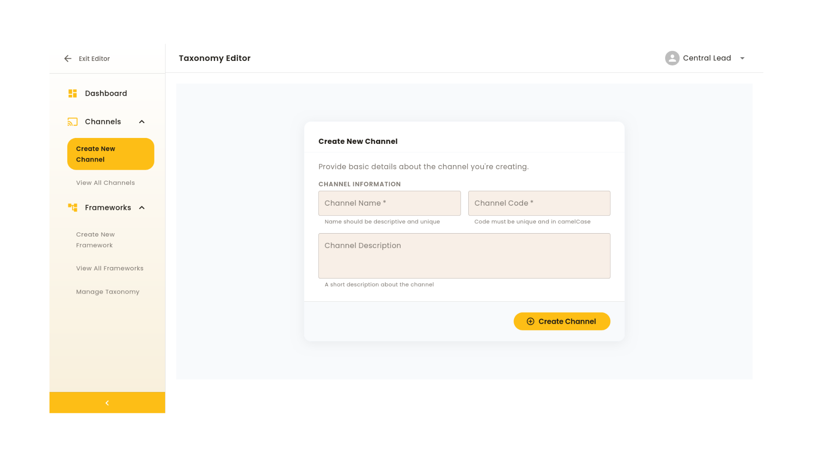
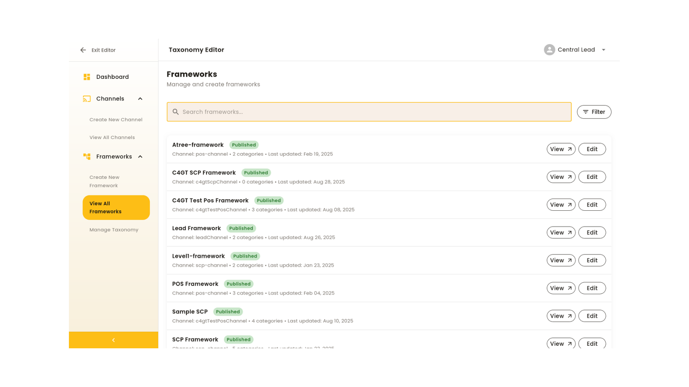
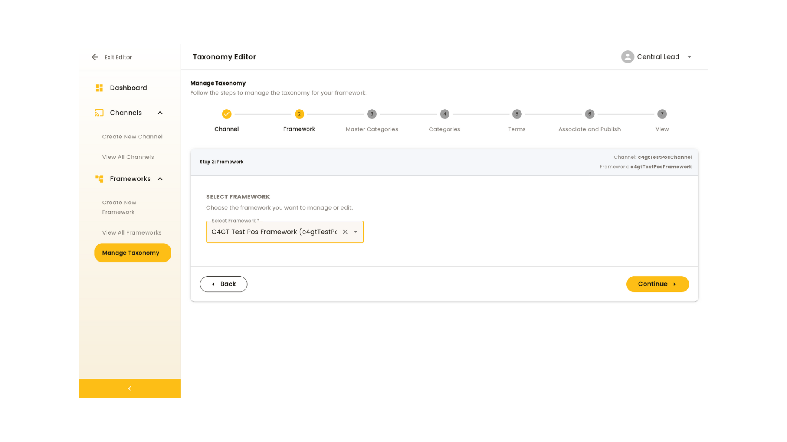
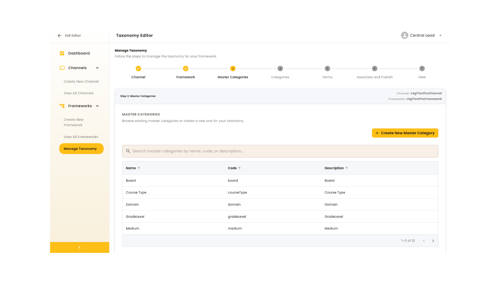
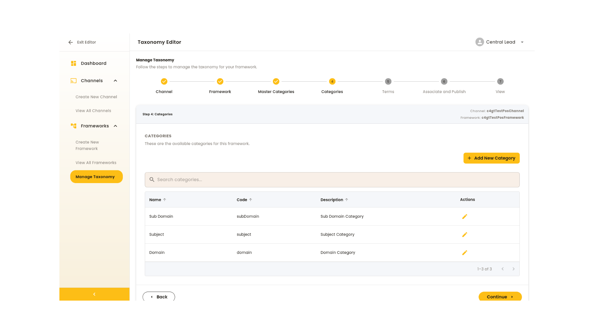
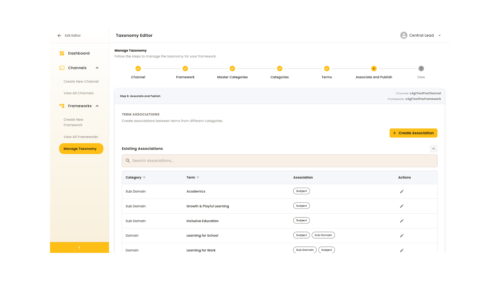
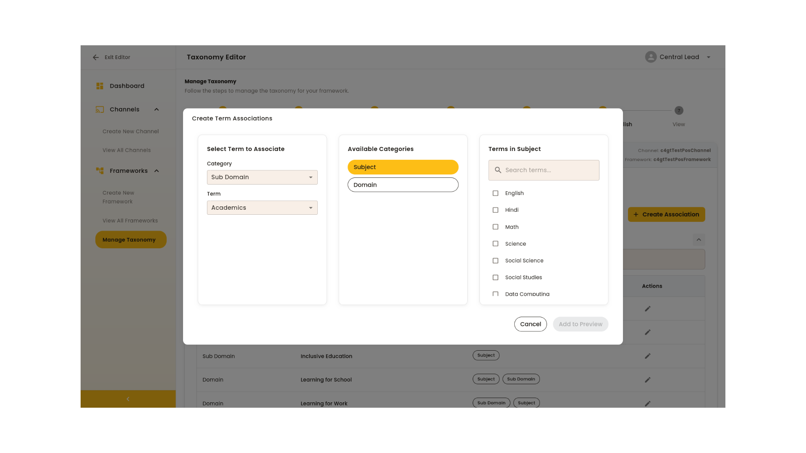
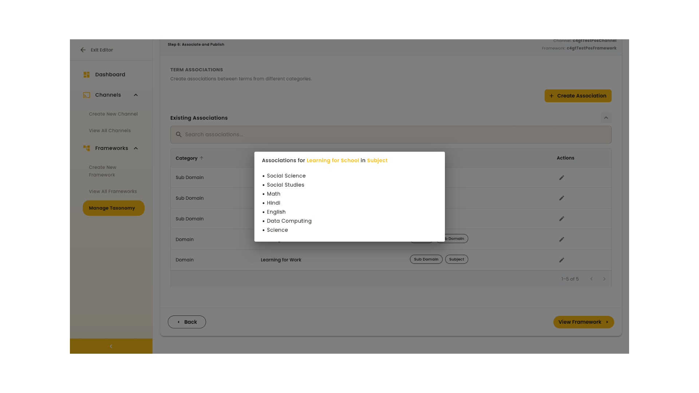

# Taxonomy Management - Complete Guide

This comprehensive document maps the Taxonomy Editor screens to their corresponding API calls and payloads, providing a complete reference for understanding both the user interface and backend implementation.

## Overview

The Taxonomy Editor provides an intuitive interface for managing hierarchical taxonomy structures. This guide shows the relationship between each screen and the underlying API calls that power the functionality.

A rough high-level overview of the screens and taxonomy-management can be found [here](https://drive.google.com/file/d/1piby_KpbRiIJjVThbfyyu4Gjv-01WXgZ/view?usp=sharing)

An [example Postman collection](./C4GT%20Test%20-%20pratham2.0.postman_collection.json) has also been provided in this directory for API reference.

## Table of Contents

1. [Dashboard (Landing Page)](#dashboard-landing-page)
2. [Create Channel](#create-channel)
3. [View All Channels](#view-all-channels)
4. [Create New Framework](#create-new-framework)
5. [View All Frameworks](#view-all-frameworks)
6. [View Framework Details](#view-framework-details)
7. [Manage Taxonomy](#manage-taxonomy)
8. [Exit Editor](#exit-editor)

---

## Dashboard (Landing Page)

### Screen Overview

The Dashboard serves as the main entry point after accessing the taxonomy editor. It provides a comprehensive overview of your current instance and quick access to key functionality.

**Features:**

- Instance Statistics: Displays total numbers of channels, frameworks, master categories, and categories
- Recent Activity: Shows recently updated channels and frameworks
- Quick Actions: Shortcut to create new frameworks
- Navigation Hub: Central access to all sections


### API Calls Used

**Get Dashboard Statistics:**

```bash
# Multiple API calls to gather statistics
GET /channel/v3/list        # Get total channels
GET /framework/v3/list      # Get total frameworks
GET /framework/v3/category/master/list  # Get master categories
```

**Get Recent Activity:**

```bash
GET /framework/v3/list?sort=lastUpdatedOn:desc&limit=5
GET /channel/v3/list?sort=lastUpdatedOn:desc&limit=5
```

---

## Create Channel

### Screen Overview

Allows users to establish new channels within the taxonomy structure. Channels serve as top-level organizational units for frameworks.

**Features:**

- Channel name and description input
- Auto-generated unique channel code
- Built-in validation
- Clean, intuitive form design



### API Calls Used

**Create Channel:**

```bash
POST /channel/v3/create
```

**Payload:**

```json
{
  "request": {
    "channel": {
      "name": "C4gt Test Channel",
      "code": "c4gtTestChannel",
      "description": "This is test channel for c4gt"
    }
  }
}
```

**Response:**

```json
{
  "id": "api.channel.create",
  "ver": "3.0",
  "responseCode": "OK",
  "result": {
    "identifier": "c4gtTestChannel",
    "node_id": "c4gtTestChannel"
  }
}
```

---

## View All Channels

### Screen Overview

Provides a comprehensive listing of all existing channels in your instance, designed for easy browsing and management.

**Features:**

- Complete channel list view
- Channel details access
- Search and filter capabilities
- Future-ready for editing functionality


### API Calls Used

**List All Channels:**

```bash
GET /channel/v3/list
```

**Read Specific Channel:**

```bash
GET /channel/v3/read/{channelId}
```

**Update Channel (if editing):**

```bash
PATCH /channel/v3/update/{channelId}
```

**Update Payload Example:**

```json
{
  "request": {
    "channel": {
      "description": "Updated channel description"
    }
  }
}
```

---

## Create New Framework

### Screen Overview

Enables users to establish new frameworks within selected channels, providing structure for organizing categories and terms.

**Features:**

- Channel selection dropdown
- Framework name and description input
- Auto-generated framework codes
- Hierarchical organization maintenance


### API Calls Used

**Create Framework:**

```bash
POST /framework/v3/create
```

**Headers:**

```
X-Channel-Id: {channelId}
Content-Type: application/json
```

**Payload:**

```json
{
  "request": {
    "framework": {
      "name": "Vidya Framework",
      "code": "vidyaFramework",
      "description": "Framework for testing UI flow for taxonomy management",
      "type": "K-12",
      "channel": "c4gtTestChannel"
    }
  }
}
```

---

## View All Frameworks

### Screen Overview

Displays all frameworks across your instance with powerful filtering and viewing capabilities.

**Features:**

- Complete framework listing
- Channel-based filtering
- Framework details access
- Overview displays with association modeling



### API Calls Used

**List All Frameworks:**

```bash
GET /framework/v3/list
```

**Filter Frameworks by Channel:**

```bash
GET /framework/v3/list?channel={channelId}
```

**Read Framework Details:**

```bash
GET /framework/v3/read/{frameworkCode}
```

---

## View Framework Details

### Screen Overview

Provides a comprehensive, sortable view of all elements within a specific framework, offering complete visibility into the taxonomy structure.

**Features:**

- Complete overview of categories, terms, and associations
- Sortable tables for easy navigation
- Association mapping visualization
- Hierarchical structure display


### API Calls Used

**Get Complete Framework Structure:**

```bash
GET /framework/v3/read/{frameworkCode}?mode=edit
```

**Get Framework Categories:**

```bash
GET /framework/v3/category/read/{categoryCode}?framework={frameworkCode}
```

---

## Manage Taxonomy

### Screen Overview

The core functionality section that guides users through the complete process of building and maintaining taxonomy structures through multiple steps.

### Step 1: Channel Selection

**Screen Description:** Select the specific channel to work with from available channels.


**API Calls:**

```bash
GET /channel/v3/list    # Get available channels
```

### Step 2: Framework Selection

**Screen Description:** Choose the specific framework within the selected channel to manage.



**API Calls:**

```bash
GET /framework/v3/list?channel={channelId}    # Get frameworks for selected channel
```

### Step 3: Master Categories Management

**Screen Description:** View and create master categories that serve as the foundation for the taxonomy.




**API Calls:**

**List Master Categories:**

```bash
GET /framework/v3/category/master/list
```

**Create Master Category (Board Example):**

```bash
POST /framework/v3/category/master/create
```

**Payload:**

```json
{
  "request": {
    "category": {
      "name": "Board",
      "description": "Board",
      "code": "board",
      "targetIdFieldName": "targetBoardIds",
      "searchLabelFieldName": "se_boards",
      "searchIdFieldName": "se_boardIds",
      "orgIdFieldName": "boardIds"
    }
  }
}
```

**Other Master Categories (State, Medium, GradeLevel, Subject):**

```json
// State
{
  "request": {
    "category": {
      "name": "State",
      "code": "state",
      "description": "State category",
      "targetIdFieldName": "targetStateIds",
      "searchLabelFieldName": "se_states",
      "searchIdFieldName": "se_stateIds",
      "orgIdFieldName": "stateIds"
    }
  }
}

// Medium
{
  "request": {
    "category": {
      "name": "Medium",
      "code": "medium",
      "description": "Medium category",
      "targetIdFieldName": "targetMediumIds",
      "searchLabelFieldName": "se_mediums",
      "searchIdFieldName": "se_mediumIds",
      "orgIdFieldName": "mediumIds"
    }
  }
}

// GradeLevel
{
  "request": {
    "category": {
      "name": "GradeLevel",
      "code": "gradeLevel",
      "description": "Grade Level category",
      "targetIdFieldName": "targetGradeLevelIds",
      "searchLabelFieldName": "se_gradeLevels",
      "searchIdFieldName": "se_gradeLevelIds",
      "orgIdFieldName": "gradeLevelIds"
    }
  }
}

// Subject
{
  "request": {
    "category": {
      "name": "Subject",
      "code": "subject",
      "description": "Subject category",
      "targetIdFieldName": "targetSubjectIds",
      "searchLabelFieldName": "se_subjects",
      "searchIdFieldName": "se_subjectIds",
      "orgIdFieldName": "subjectIds"
    }
  }
}
```

### Step 4: Categories Management

**Screen Description:** Create and manage categories within the framework, with batch creation capabilities.




**API Calls:**

**Create Framework Category:**

```bash
POST /framework/v3/category/create?framework={frameworkCode}
```

**Payload (Subject Example):**

```json
{
  "request": {
    "category": {
      "name": "Subject",
      "code": "subject",
      "description": "Subject category"
    }
  }
}
```

**Read Framework Category:**

```bash
GET /framework/v3/category/read/{categoryCode}?framework={frameworkCode}
```

**Update Framework Category:**

```bash
PATCH /framework/v3/category/update/{categoryCode}?framework={frameworkCode}
```

**Update Payload:**

```json
{
  "request": {
    "category": {
      "description": "Updated category description"
    }
  }
}
```

### Step 5: Terms Management

**Screen Description:** Create and manage terms within categories, supporting batch operations and preview functionality.


**API Calls:**

**Create Term:**

```bash
POST /framework/v3/term/create?framework={frameworkCode}&category={categoryCode}
```

**Payload (CBSE Board Example):**

```json
{
  "request": {
    "term": {
      "name": "CBSE",
      "label": "CBSE",
      "description": "CBSE Board",
      "code": "cbse"
    }
  }
}
```

**Additional Term Examples:**

```json
// Medium - English
{
  "request": {
    "term": {
      "name": "English",
      "label": "English",
      "description": "English Medium",
      "code": "english"
    }
  }
}

// GradeLevel - Class 10
{
  "request": {
    "term": {
      "name": "Class 10",
      "label": "Class 10",
      "description": "Grade Level 10",
      "code": "class10"
    }
  }
}

// Subject - Mathematics
{
  "request": {
    "term": {
      "name": "Mathematics",
      "label": "Mathematics",
      "description": "Mathematics Subject",
      "code": "mathematics"
    }
  }
}
```

### Step 6: Associations Management

**Screen Description:** Create relationships between categories and terms using an intuitive interface with preview functionality.





**API Calls:**

**Update Term with Associations:**

```bash
PATCH /framework/v3/term/update/{termCode}?framework={frameworkCode}&category={categoryCode}
```

**Payload (GradeLevel - Class 10 Associations Example):**

```json
{
  "request": {
    "term": {
      "associationswith": [
        { "identifier": "vidyaFramework_medium_english" },
        { "identifier": "vidyaFramework_medium_hindi" },
        { "identifier": "vidyaFramework_board_cbse" }
      ],
      "associations": [
        { "identifier": "vidyaFramework_subject_mathematics" },
        { "identifier": "vidyaFramework_subject_science" },
        { "identifier": "vidyaFramework_subject_history" }
      ]
    }
  }
}
```

**Additional Association Examples:**

```json
// Medium - English Associations
{
  "request": {
    "term": {
      "associationswith": [
        { "identifier": "vidyaFramework_board_cbse" }
      ],
      "associations": [
        { "identifier": "vidyaFramework_gradeLevel_class10" },
        { "identifier": "vidyaFramework_subject_mathematics" }
      ]
    }
  }
}

// Board - CBSE Associations
{
  "request": {
    "term": {
      "associations": [
        { "identifier": "vidyaFramework_medium_english" },
        { "identifier": "vidyaFramework_medium_hindi" },
        { "identifier": "vidyaFramework_gradeLevel_class10" }
      ]
    }
  }
}
```

### Step 7: Publishing and Framework View

**Screen Description:** Automatic publishing of changes and presentation of the complete framework view with sortable tables.


**API Calls:**

**Publish Framework:**

```bash
POST /framework/v3/publish/{frameworkCode}
```

**Headers:**

```
X-Channel-Id: {channelId}
Content-Type: application/json
```

**Response:**

```json
{
  "id": "api.taxonomy.framework.publish",
  "ver": "3.0",
  "responseCode": "OK",
  "result": {
    "publishStatus": "Publish Event for Framework Id 'vidyaFramework' is pushed Successfully!"
  }
}
```

**Get Published Framework:**

```bash
GET /framework/v3/read/{frameworkCode}
```

---

## Exit Editor

### Screen Overview

Provides a clean way to leave the taxonomy editor and return to the previous workflow.


---

## Complete API Workflow Summary

### Sequential API Call Flow

1. **Channel Management**

   - `POST /channel/v3/create` → Create channel
   - `GET /channel/v3/read/{channelId}` → Verify channel

2. **Framework Management**

   - `POST /framework/v3/create` → Create framework
   - `GET /framework/v3/read/{frameworkCode}` → Verify framework

3. **Master Category Setup**

   - `POST /framework/v3/category/master/create` → Create each master category (Board, State, Medium, GradeLevel, Subject)

4. **Framework Category Setup**

   - `POST /framework/v3/category/create?framework={frameworkCode}` → Create framework categories

5. **Term Creation**

   - `POST /framework/v3/term/create?framework={frameworkCode}&category={categoryCode}` → Create terms for each category

6. **Association Management**

   - `PATCH /framework/v3/term/update/{termCode}?framework={frameworkCode}&category={categoryCode}` → Create associations between terms

7. **Framework Publishing**
   - `POST /framework/v3/publish/{frameworkCode}` → Publish the complete framework

### Important Notes

- **Authentication**: All API calls require proper authentication headers
- **Channel Context**: Framework operations require `X-Channel-Id` header
- **Sequential Dependencies**: Master categories must exist before framework categories, which must exist before terms
- **Association Constraints**: At least one association must remain (backend requirement)
- **Publishing**: Automatic publishing occurs when associations are saved

### Error Handling

- Validate prerequisites (master categories before categories, categories before terms)
- Check for unique codes and names
- Ensure proper parent-child relationships
- Handle association constraints properly
