# Taxonomy Editor - User Guide

The Taxonomy Editor is a comprehensive tool designed to help users manage hierarchical taxonomy structures through an intuitive interface. This guide provides a detailed overview of all screens and features available in the application.

A rough high-level overview of the screens and taxonomy-management can be found [here](https://drive.google.com/file/d/1piby_KpbRiIJjVThbfyyu4Gjv-01WXgZ/view?usp=sharing)

An [example Postman collection](./C4GT%20Test%20-%20pratham2.0.postman_collection.json) has also been provided in this directory for API reference.

## Table of Contents

1. [Dashboard (Landing Page)](#dashboard-landing-page)
2. [Create Channel](#create-channel)
3. [View All Channels](#view-all-channels)
4. [Create New Framework](#create-new-framework)
5. [View All Frameworks](#view-all-frameworks)
6. [View Framework Details](#view-framework-details)
7. [Manage Taxonomy](#manage-taxonomy)
8. [Exit Editor](#exit-editor)

---

## Option to taxonomy editor from Admin app

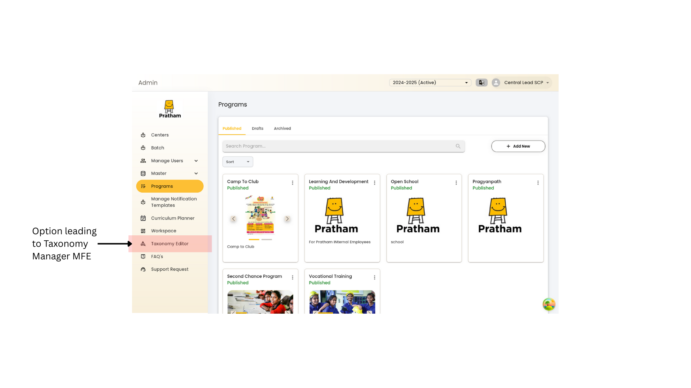

---

## Dashboard (Landing Page)

The Dashboard serves as the main entry point after accessing the taxonomy editor. It provides a comprehensive overview of your current instance and quick access to key functionality.

### Features:

- **Instance Statistics**: Displays the total number of channels, frameworks, master categories, and categories in your current instance
- **Recent Activity**: Shows recently updated channels and frameworks for quick access
- **Quick Actions**: Provides a shortcut button to create a new framework directly from the dashboard
- **Navigation Hub**: Central location for accessing all other sections of the application

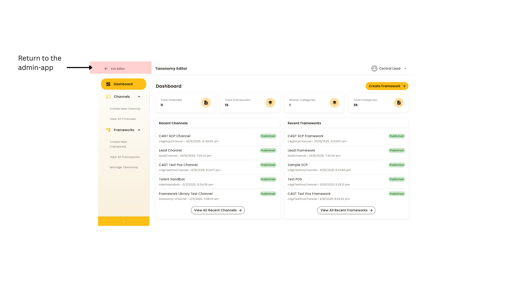

---

## Create Channel

The Create Channel screen allows users to establish new channels within the taxonomy structure. Channels serve as the top-level organizational units for frameworks.

### Features:

- **Channel Information**: Input fields for channel name and description
- **Auto-Generated Code**: The system automatically generates a unique channel code
- **Validation**: Built-in validation ensures proper channel creation
- **User-Friendly Interface**: Clean, intuitive form design for easy data entry

### Process:

1. Navigate to the Create Channel screen
2. Enter a descriptive channel name
3. Provide a detailed description of the channel's purpose
4. Review the auto-generated channel code
5. Submit to create the new channel

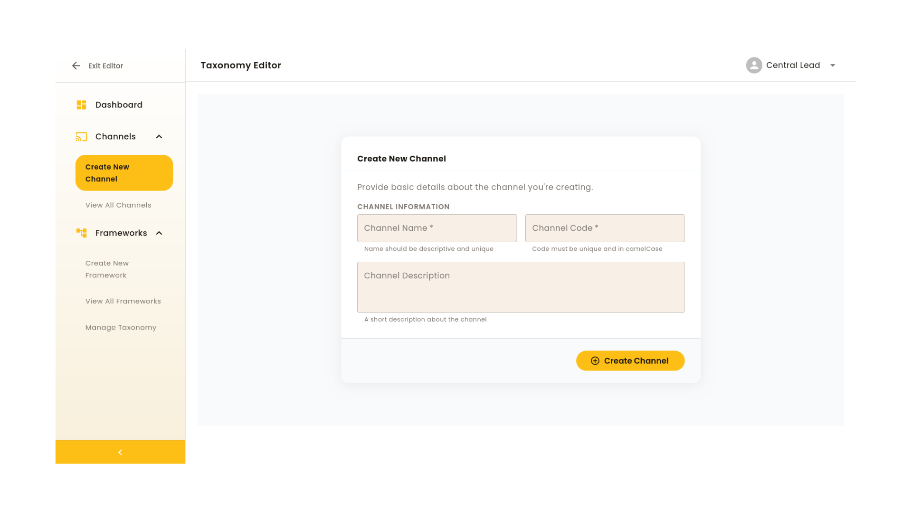

---

## View All Channels

This screen provides a comprehensive listing of all existing channels in your instance, designed for easy browsing and management.

### Features:

- **Complete Channel List**: View all channels in your current instance
- **Channel Details**: Quick access to basic information about each channel
- **Extensible Design**: Built with future channel editing functionality in mind
- **Search and Filter**: Easy navigation through large numbers of channels

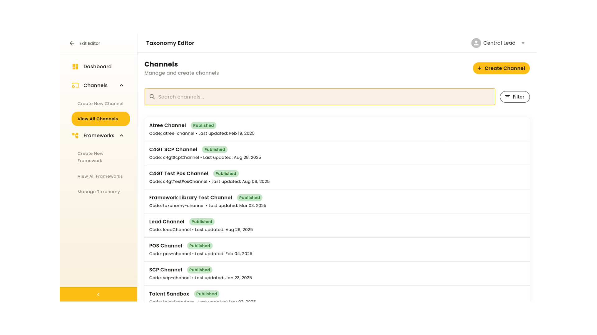

---

## Create New Framework

The Create New Framework screen enables users to establish new frameworks within selected channels, providing the structure for organizing categories and terms.

### Features:

- **Channel Selection**: Choose the parent channel for your new framework
- **Framework Details**: Input fields for framework name and description
- **Auto-Generated Code**: System generates unique framework codes automatically
- **Hierarchical Organization**: Maintains proper parent-child relationships between channels and frameworks

### Process:

1. Select the target channel from available options
2. Enter a meaningful framework name
3. Provide a comprehensive description
4. Review the auto-generated framework code
5. Create the framework

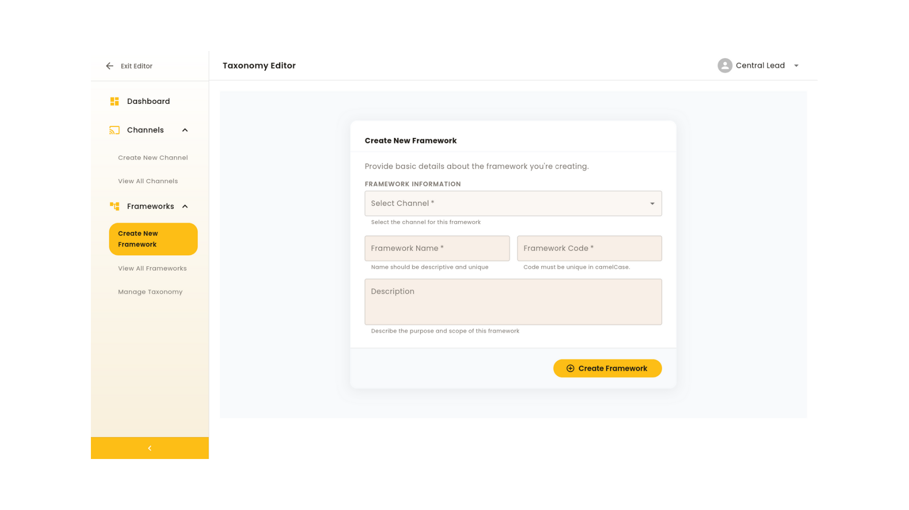

---

## View All Frameworks

This comprehensive screen displays all frameworks across your instance with powerful filtering and viewing capabilities.

### Features:

- **Complete Framework Listing**: View all frameworks in your instance
- **Channel-Based Filtering**: Filter frameworks by their parent channels
- **Framework Details**: Access detailed information about each framework
- **Overview Display**: Quick summary of framework contents
- **Association Modeling**: Visual representation of how terms are associated within frameworks

### Navigation Options:

- Filter by specific channels
- View framework overviews
- Access detailed framework information
- Navigate to framework management

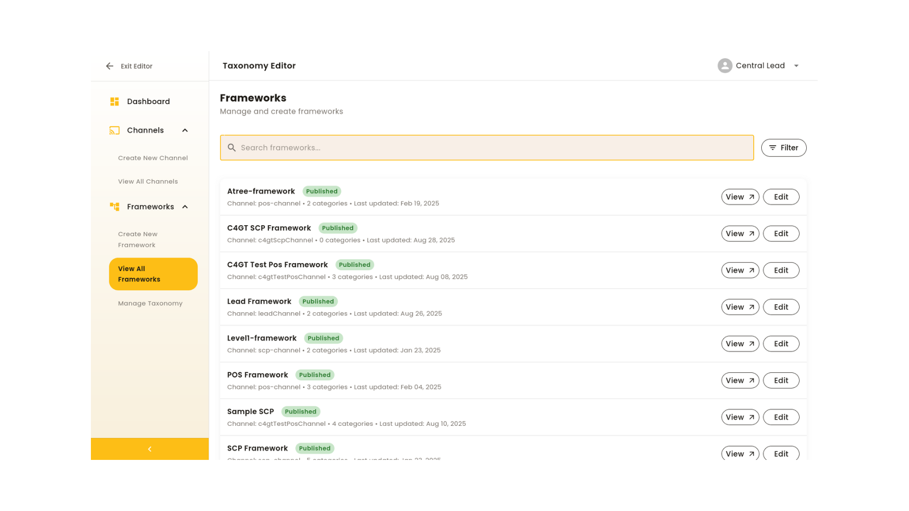

---

## View Framework Details

The Framework Details screen provides a comprehensive, sortable view of all elements within a specific framework, offering complete visibility into the taxonomy structure.

### Features:

- **Complete Overview**: All categories, terms, and associations in one view
- **Sortable Tables**: Organize data by various criteria for easier navigation
- **Association Mapping**: Clear visualization of relationships between different elements

### Components Displayed:

- All categories within the framework
- Complete terms listing
- Association relationships
- Hierarchical structure visualization

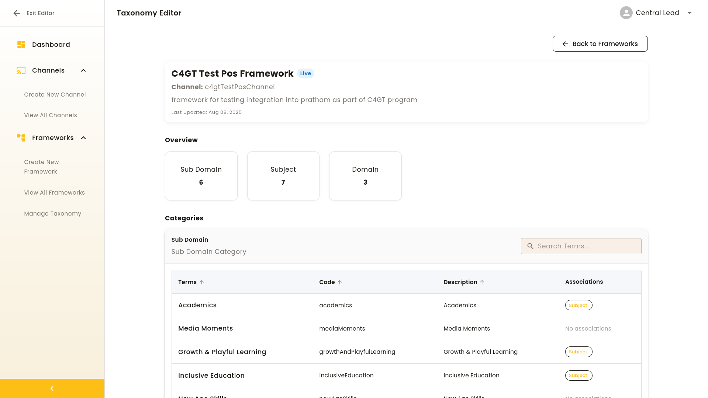

---

## Manage Taxonomy

The Manage Taxonomy section is the core functionality of the editor, guiding users through the complete process of building and maintaining taxonomy structures.

### Overview

This multi-step process allows users to systematically create and manage all aspects of their taxonomy, from high-level categories to detailed term associations.

### Step 1: Channel Selection

The first step in managing taxonomy is to select the specific channel you want to work with from your available channels.

**Process:**

1. Navigate to the Manage Taxonomy section
2. Review the list of available channels in your instance
3. Select your target channel from the dropdown or list
4. Confirm your channel selection to proceed

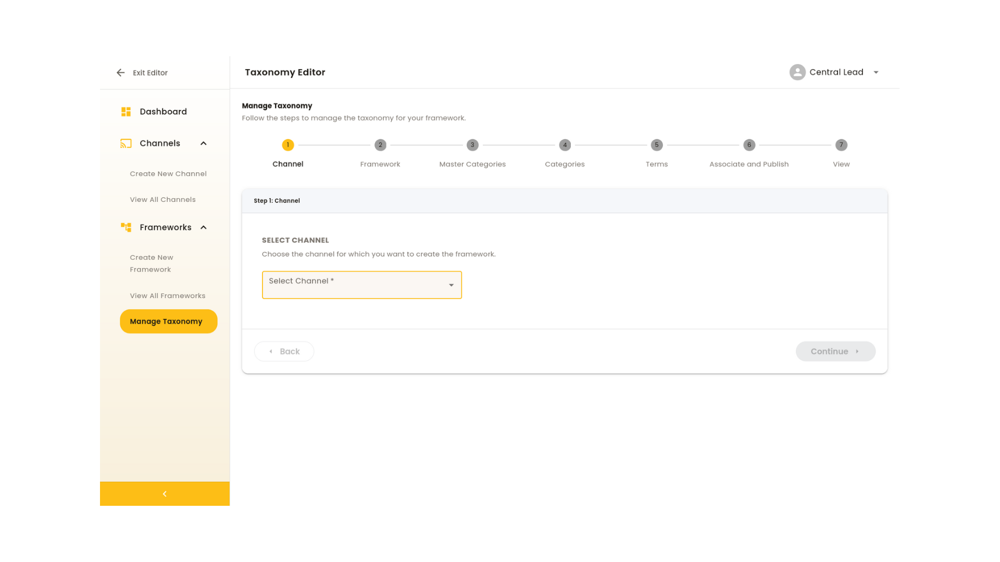

### Step 2: Framework Selection

After selecting a channel, you need to choose the specific framework within that channel that you want to manage.

**Process:**

1. View all frameworks available under the selected channel
2. Review framework details and descriptions if needed
3. Choose the specific framework you want to manage
4. Proceed to the taxonomy management interface

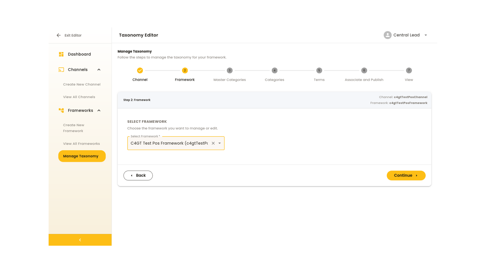

### Step 3: Master Categories Management

Master categories serve as the foundation for categories in your taxonomy.

**Features:**

- **View Existing**: Display all current master categories in the instance
- **Create New**: Add new master categories as needed
- **Category Overview**: Quick summary of master category structure

**Process:**

1. Review existing master categories
2. Identify gaps or new requirements
3. Create additional master categories as needed

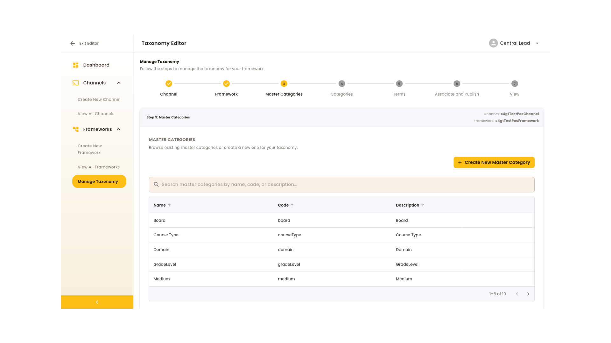
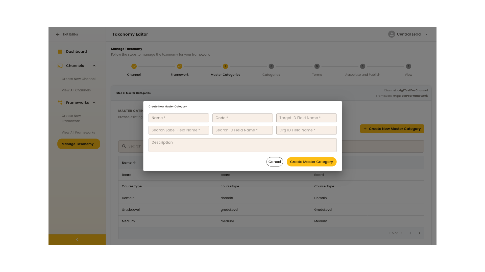

### Step 4: Categories Management

Categories provide the detailed organizational structure within master categories.

**Features:**

- **Prerequisite Check**: Requires corresponding master category to exist
- **Edit Existing**: Modify category details (code remains unchanged)
- **Batch Creation**: Create multiple categories simultaneously
- **Preview Table**: View categories pending creation before submission

**Process:**

1. Ensure required master categories exist
2. Create new categories or edit existing ones
3. Review pending categories in the preview table
4. Execute batch creation via API calls

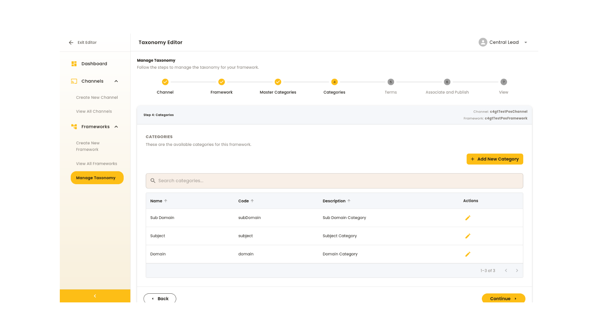
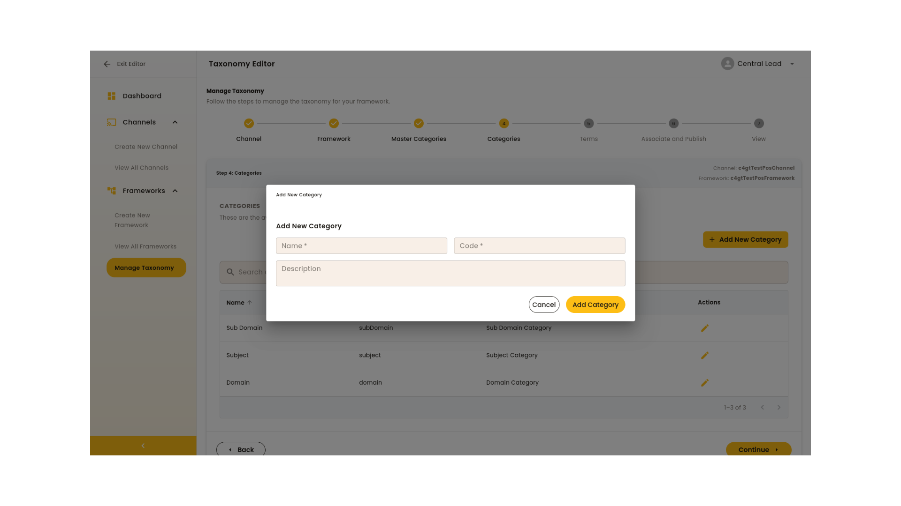
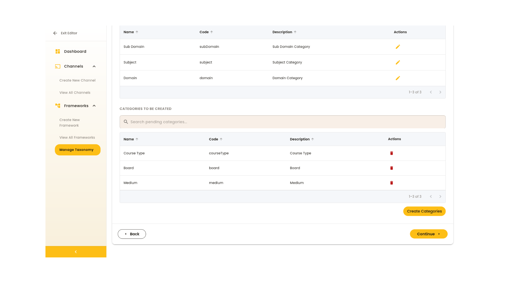

### Step 5: Terms Management

Terms represent the most granular level of taxonomy organization within categories.

**Features:**

- **Category-Based Organization**: View and create terms under selected categories
- **Batch Operations**: Add multiple terms simultaneously
- **Preview Functionality**: Review terms before creation
- **API Integration**: Multiple API calls for efficient batch creation

**Process:**

1. Select target categories for term creation
2. Add individual terms or use batch creation
3. Review terms in the pending creation table
4. Execute creation process

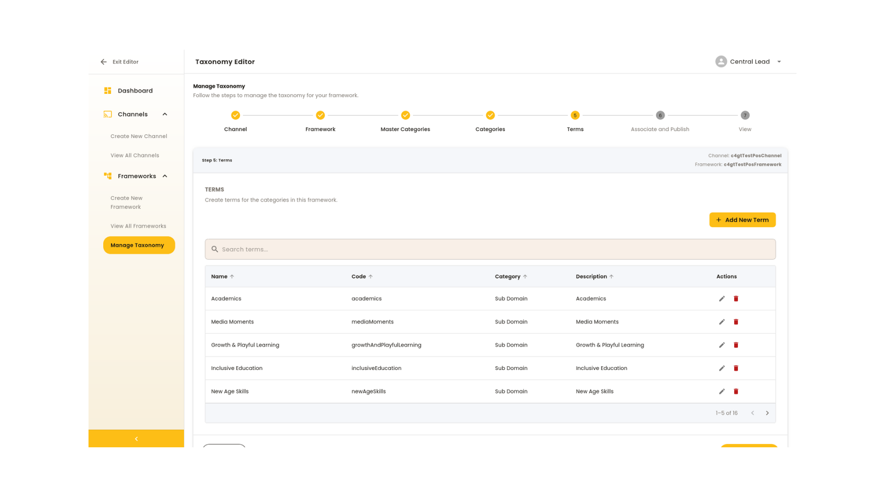

### Step 6: Associations Management

Associations define the relationships between categories and terms, forming the core logic of your taxonomy.

**Features:**

- **Model-Based Form**: Intuitive interface for creating associations
- **Category Selection**: Choose source categories for associations
- **Term Mapping**: Select and associate terms between different categories
- **Preview Changes**: Review associations before saving
- **Edit/Delete**: Modify existing associations (with backend constraints)
- **Publishing Integration**: Automatic publish calls when saving associations

**Important Constraints:**

- At least one association must always remain (backend requirement)
- Saving associations triggers both update and publish API calls

**Process:**

1. Select a source category
2. Choose terms within that category
3. Select target terms from other categories
4. Preview the association structure
5. Save associations (triggers publishing)

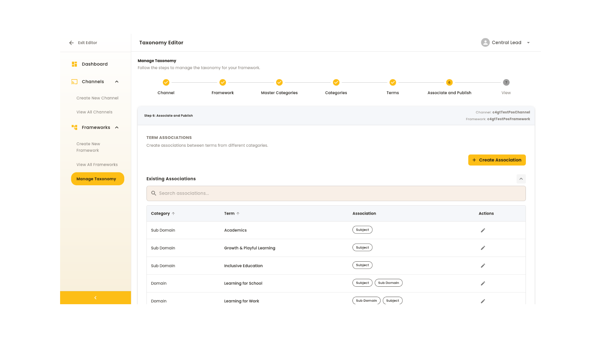
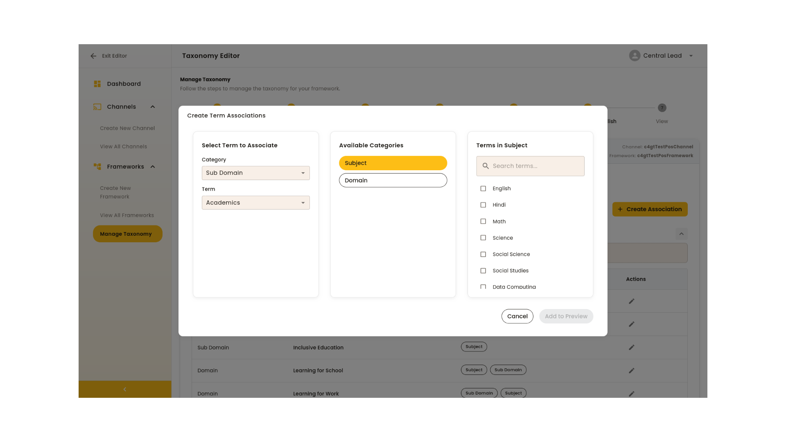
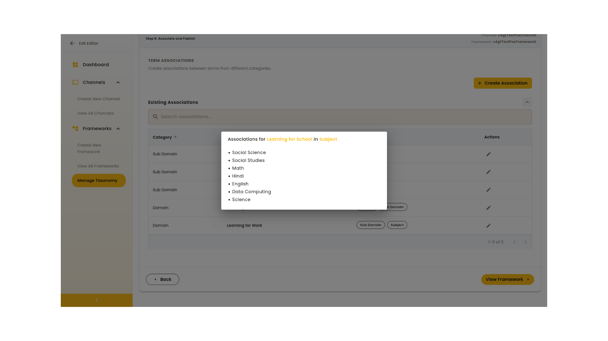

### Step 7: Publishing and Framework View

After managing associations, the system automatically handles publishing and presents the complete framework view.

**Automatic Processes:**

- **Publishing**: All changes are automatically published when associations are saved
- **Framework Update**: The complete framework structure is updated
- **Primary View**: Users are presented with a comprehensive view of all framework elements

**Final View Features:**

- Complete categories, terms, and associations in sortable tables
- Easy navigation between different framework elements
- Quick access to return to framework overview

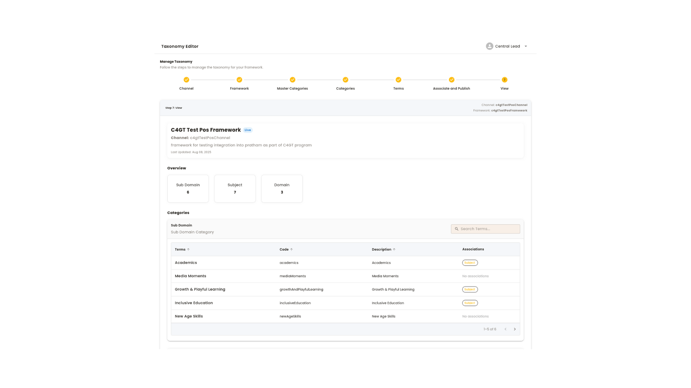

---

## Exit Editor

The Exit Editor function provides a clean way to leave the taxonomy editor and return to your previous workflow.

---
